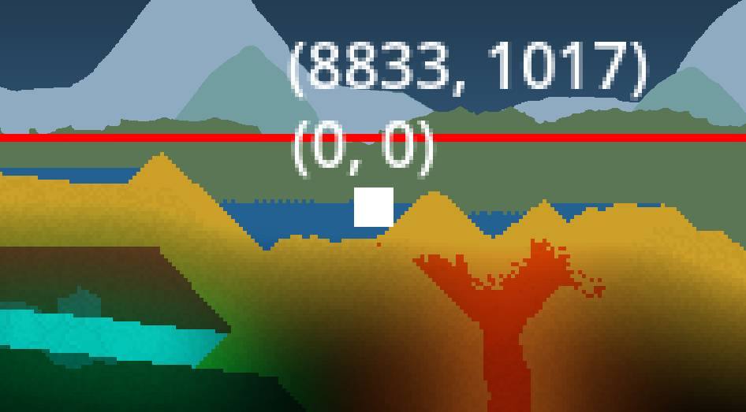

# Pixitale


## Editor Build
See https://docs.godotengine.org/en/stable/contributing/development/compiling/index.html for requirements.
Commands to easily build and launch the editor as well as update compile_commands.json (for use with clangd) are in: `custom/.vscode/tasks.json`. These commands are meant to run from `custom/` folder.

## Notes
Need to move these into the editor or design wiki.

- Generation performance: Generation passes should abort as early as possible when it has nothing to do. Eg. When generating surface terrain, check if anywhere near the surface before iterating over each cells or doing expensive operations. Generating noise is especially expensive.
- Generation randomness: To generate independently of time, use rand methods from `GridChunkIter` which will output the same value based on chunk coordinate and uses from previous generation passes.
- Sharing data between generation passes: Add it as metadata to `GridChunkIter`. The same iterator is used throughout the chunk generation. It is just reset to start at `(0,0)` before each pass.
- Multiplayer and determinism: The grid has too much data to be sent to clients in real time. Therefore it is only sent once along with successive mutations in order. A mutation is deterministic if it only takes inputs from deterministic sources or is synchronized through methods from `GridApi.add_grid_edit_method()`. These methods are initiated from the server and sent to clients to be executed with the same inputs at the same `Grid.tick` in the same order. Desync sources include:
Using gdscript's `randb` and friends instead of analogous methods exposed on `Grid`.
Trigonometric methods on float (sin, cos, tan) and anything which relies on them. +, -, *, /, sqrt and all of int are Ok.
Everything else (enemies, projectile, etc.) uses the standard authoritative server approach to networking.

## Todo

#### Cell Movement
- [x] Particle movement
- [x] Sand movement
- [ ] Wind effect

#### Background Cell
- Just material and color. No movement or reaction.
- Takes no memory if none are in a chunk.

#### Cell Color
When creating new cells, add noise (soil, sand, etc)

Border texture (brick, wood, etc): Maybe a simple fake depth using shader?

#### Light
Raycast using the current cell buffer. Update each frame. 
Light is applied using subtractive blending mode. Full light is black (no effect) and no light is white (darken everything by 100%). 

Normal light: 
- Given a position and a raycast origin, sample the cell buffer from the raycast origin to the fragment position. 
- To prevent performance problem when there are many lights, for each x (comfigurable amount) lights on screen, reduced the number sample when raycasting. 

Global light:
- Represent light coming from the background: sun, moon, lava lake, etc.
- Unique light set by the biome. 
- Similar to normal light, but sample from a direction instead of a point. Also blocked by background cell.

#### Npc
- Shared between players in multiplayer?

#### Home Area
- Can flag chunks as home. Save what the player built and gets repaired for free.
- Should repair speed increase with the number of npc?
- Needs an npc home nearby?
- Shared between players in multiplayer?

#### Stats
To make it simple to compute stats, all stats are additive and use int.

Eg. A skill with the tag `projectile` would compute its damage like so:
```Python
class_name Character

# Tags: 0)all, 1)projectile, 2)area, 3)spell, 4)melee, 5)cold, etc...
var base_damage : Array[int] = [1, 2, 3, 4, 5, 6]
var increased_damage : Array[int] = [7, 0, 2, 0, 4, 3]
var increased_projectile : Array[int] = [6, 5, 4, 3, 2, 1]

func compute_damage(tags: Array[int]) -> float:
  var dmg := 0
  var inc_dmg := 0
  for tag in tags:
    if tag < base_damage.size():
      dmg += base_damage[tag]
    if tag < increased_damage.size():
      inc_dmg += increased_damage[tag]
  return float(dmg) * float(inc_dmg) * 0.01
```
An item which increase cold damage by 15% would simply do:
```Python
func equip(character: Character) -> void:
  if MyMod.TAG_COLD_IDX >= character.increased_damage.size():
    character.resize(MyMod.TAG_COLD_IDX)
  character[MyMod.TAG_COLD_IDX] += 15

func unequip(character: Character) -> void:
  character[MyMod.TAG_COLD_IDX] -= 15
```

#### State Serialization
- Serialize and compress the grid.
- Other deterministic things.

