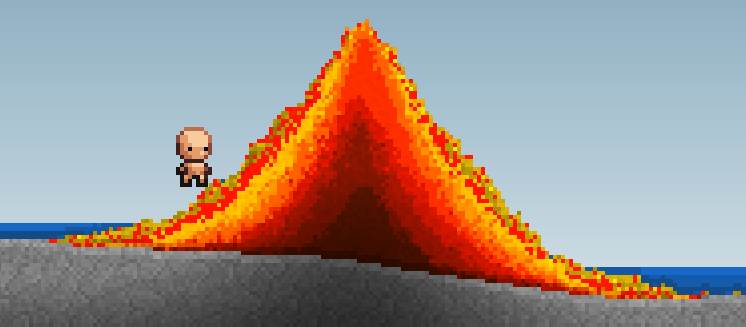

# Pixitale

## Editor Build
See https://docs.godotengine.org/en/stable/contributing/development/compiling/index.html for requirements.
Commands to easily build and launch the editor as well as update compile_commands.json (for use with clangd) are in: `custom/.vscode/tasks.json`. These commands are meant to run from `custom/` folder.

## Notes
Need to move these into the editor or design wiki.

- Multiplayer and determinism: The grid has too much data to be sent to clients in real time. Therefore it is only sent once along with successive mutations in order. A mutation is deterministic if it only takes inputs from deterministic sources or is synchronized through methods from `GridApi.add_grid_edit_method()`. These methods are initiated from the server and sent to clients to be executed with the same inputs at the same `Grid.tick` in the same order. Desync sources include:
Using gdscript's `randb` and friends instead of analogous methods exposed on `Grid`.
Trigonometric methods on float (sin, cos, tan) and anything which relies on them. +, -, *, /, sqrt and all of int are Ok.
Everything else (enemies, projectile, etc.) uses the standard authoritative server approach to networking.

## Todo

#### World Generation
- [ ] Castle

#### Build
- [x] Add github workflow for all targets.
- [x] Upload editor builds.
- [x] Add automatic determinism test.

#### Edits
- [ ] (server) Skip step if previous step did not finish. Slow down simulation instead of whole game.
- [ ] (client) Immediately try to start next step if commands are available instead of waiting for next frame.

#### Cell Movement
- [x] Particle movement
- [x] Sand movement
- [ ] Wind effect. Light cell move horizontally based on wind value when moving vertically.
- [x] Small bug: Cell very rarely go to sleep even around moving liquid. Probably caused by flow changes.

#### Background Cell
- [ ] Expose to gdscript (grid & iters)
- [x] Just material and color. No movement or reaction.
- [x] Free memory if chunk is empty.

#### Cell Color
- [x] When creating new cells, add noise (soil, sand, etc)
- [x] Border texture (brick, wood, etc): Maybe a simple fake depth using shader?
- [x] Replace color with darken + palette. 6 bits each
- [ ] Smoother fake depth.

#### Keep processing chunk until inactive
- [ ] Add neighbors chunk when needed.
- [ ] Flag for reaction pair which shouldn't keep chunk active (for visual only or infinite reactions).
- [ ] Configurable maximum number of chunk to process per sim step.
- [ ] Prioritize chunks which were requested from Godot's side then those which haven't been updated for the longest.

#### Liquid dispersion
- [x] Detect which direction liquid should flow for fastest dispersion. Eg. If most cell have been successful moving to right chunk and not moving to left chunk, prioritize moving right. (Used flow instead)

#### Liquid shader
- [ ] Try using metaball to render liquid.
- [ ] Surface wave shader when things enter/leave liquid.
- [ ] Distortion shader instead of simple transparency.

#### Light
Raycast using the current cell buffer. Update each frame. 
Light is applied using multiplicative blending mode.

- [ ] Normal light: 
- Given a position and a raycast origin, sample the cell buffer from the raycast origin to the fragment position. 
- To prevent performance problem when there are many lights, for each x (comfigurable amount) lights on screen, reduced the number sample when raycasting. 

- [ ] Global light:
- Represent light coming from the background: sun, moon, lava lake, etc.
- Unique light set by the biome. 
- Similar to normal light, but sample from a direction instead of a point. Also blocked by background cell.

#### Npc

#### Home Area
- [x] Can flag chunks as home. Save what the player built and gets repaired for free.
- [ ] Should repair speed increase with the number of npc?
- [ ] Needs an npc home nearby?

#### Drawing
- [ ] Can save part of grid as blueprint.
- [ ] Can paste blueprint to grid.

#### Stats
Make it simple to compute stats.

#### State Serialization
- [ ] Serialize and compress the grid.
- [ ] Use serialized state for determinism test
- [ ] Other deterministic things.

#### Performance
- [ ] Unload old chunk.
- [ ] Delete chunks which never changed. Use hash or keep track of all changes.
- [ ] Use Godot thread pool.

